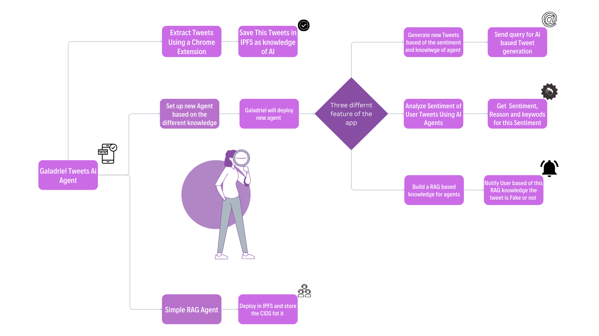

# Stake Stream

<br />
<div align="center">
<a href="https://github.com/silent-cipher/stakeStream">
   
</a>
<h2 align="center">Stake Stream</h2>

  <p align="center">
    Stake Stream
    <br />
    <br />
    <a href="https://github.com/silent-cipher/stakeStream/issues">Report Bug</a>
    ·
    <a href="https://github.com/silent-cipher/stakeStream/issues">Request Feature</a>
  </p>
</div>

## About The Project

Stake Stream

<p align="right">(<a href="#readme-top">back to top</a>)</p>

### Built With

- [![react][react]][react-url]
- [![next][next]][next-url]
- [![typescript][typescript]][typescript-url]

<p align="right">(<a href="#readme-top">back to top</a>)</p>

## Getting Started

### Installation

1. Clone the repository:

   ```sh
   https://github.com/silent-cipher/stakeStream.git
   cd stakeStream
   ```

2. Install dependencies for the frontend (Next.js):

   ```sh
   cd frontend
   npm install
   ```

3. Run the development servers:

   - For Next.js (frontend):

   ```sh
   npm run build
   npm start
   ```

   - (Backend):

   ```sh
   cd backend
   npm install
   npm start
   ```

4. Open your browser and navigate to `http://localhost:3000` for the frontend and `http://localhost:8080` for the backend admin interface.

<p align="right">(<a href="#readme-top">back to top</a>)</p>

<!-- USAGE EXAMPLES -->

## Description

Stake Stream

</br>

## Problem


## Solution



## Approach


## App Features


## Technologies Used


## Pages Overview

### Home Page


<p align="right">(<a href="#readme-top">back to top</a>)</p>

<!-- CONTRIBUTING -->

## Contributing

Contributions are what make the open source community such an amazing place to learn, inspire, and create. Any contributions you make are greatly appreciated.

If you have a suggestion that would make this better, please fork the repo and create a pull request. You can also simply open an issue with the tag "enhancement".
Don't forget to give the project a star! Thanks again!

1. Fork the Project
2. Create your Feature Branch (`git checkout -b feature/AmazingFeature`)
3. Commit your Changes (`git commit -m 'Add some AmazingFeature'`)
4. Push to the Branch (`git push origin feature/AmazingFeature`)
5. Open a Pull Request

<p align="right">(<a href="#readme-top">back to top</a>)</p>

<!-- CONTACT -->

## Acknowledgments

Use this space to list resources you find helpful and would like to give credit to. I've included a few of my favorites to kick things off!

- [GitHub Pages](https://pages.github.com)
- [Font Awesome](https://fontawesome.com)

A special thank you to all the current contributors who have made this project possible. You can view the contributors

- [silent cipher](https://github.com/silent-cipher)
- [Shivam kumar](https://github.com/shivam6862)

<p align="right">(<a href="#readme-top">back to top</a>)</p>

[contributors-shield]: https://img.shields.io/github/contributors/silent-cipher/stakeStream.svg?style=for-the-badge
[contributors-url]: https://github.com/silent-cipher/stakeStream/graphs/contributors
[forks-shield]: https://img.shields.io/github/forks/silent-cipher/stakeStream.svg?style=for-the-badge
[forks-url]: https://github.com/silent-cipher/stakeStream/network/members
[stars-shield]: https://img.shields.io/github/stars/silent-cipher/stakeStream.svg?style=for-the-badge
[stars-url]: https://github.com/silent-cipher/stakeStream/stargazers
[issues-shield]: https://img.shields.io/github/issues/silent-cipher/stakeStream.svg?style=for-the-badge
[issues-url]: https://github.com/silent-cipher/stakeStream/issues
[license-shield]: https://img.shields.io/github/license/silent-cipher/stakeStream.svg?style=for-the-badge
[license-url]: https://github.com/silent-cipher/stakeStream/blob/master/LICENSE.txt
[linkedin-shield]: https://img.shields.io/badge/-LinkedIn-black.svg?style=for-the-badge&logo=linkedin&colorB=555
[linkedin-url]: https://linkedin.com/
[react]: https://img.shields.io/badge/React-20232A?style=for-the-badge&logo=react&logoColor=61DAFB
[react-url]: https://react.dev/
[VisualStudioCode]: https://img.shields.io/badge/Made%20for-VSCode-1f425f.svg
[VisualStudioCode-url]: https://code.visualstudio.com/
[nodejs-url]: https://nodejs.org/en
[nodejs]: https://img.shields.io/badge/Node.js-43853D?style=for-the-badge&logo=node.js&logoColor=white
[mongodb-url]: https://www.mongodb.com/
[mongodb]: https://img.shields.io/badge/MongoDB-4EA94B?style=for-the-badge&logo=mongodb&logoColor=white
[next-url]: https://nextjs.org/docs
[next]: https://img.shields.io/badge/next.js-000000?style=for-the-badge&logo=nextdotjs&logoColor=white
[typescript-url]: https://www.typescriptlang.org/docs/handbook/typescript-in-5-minutes.html
[typescript]: https://img.shields.io/badge/TypeScript-007ACC?style=for-the-badge&logo=typescript&logoColor=white
